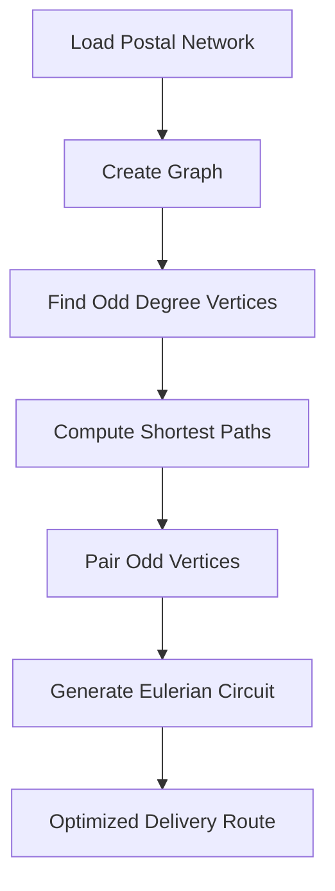

# Postal Route Optimization

A route optimization system developed to improve postal delivery efficiency by minimizing travel distance and reducing operational costs using graph theory algorithms.

## Overview

This project implements the **Chinese Postman Problem (CPP)** algorithm to determine the shortest route that traverses every required road or path at least once while returning an optimized delivery route.

## Features

* Route optimization for postal delivery networks
* Graph-based path analysis
* Chinese Postman Problem implementation
* Distance minimization
* Efficient delivery route planning
* Visualization of optimized routes

## Technologies Used

* C#
* ASP.NET
* Graph Algorithms
* Data Structures

## Algorithm

The system uses the Chinese Postman Problem approach:

1. Model delivery routes as a graph.
2. Identify vertices with odd degrees.
3. Calculate shortest paths between odd vertices.
4. Generate an Eulerian circuit.
5. Produce the optimal delivery route.

## Applications

* Postal delivery services
* Logistics optimization
* Transportation planning
* Route scheduling
* Smart mobility solutions

## Future Enhancements

* Real-time traffic integration
* GIS and map visualization
* Vehicle routing support
* Multi-depot optimization
* Interactive route dashboards

## Chinese Postman Algorithm

